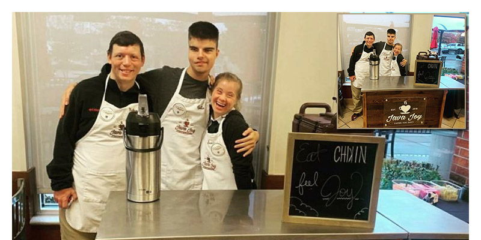

```{r setup, include=FALSE}
knitr::opts_chunk$set(echo = TRUE, eval = FALSE)
```


One of my childhood friends from Atlanta, [Chad Lindsey](https://www.linkedin.com/in/chad-lindsey-90996737/), has helped this amazing company come to SF and they'd be grateful for your business. Check Java Joy's website or connect with them on LinkedIn (links below) to learn more.

Java Joy's mission is to empower people of all abilities to transform others by spreading their unmatched joy. Their vision is to become the largest employer and best place to work in the U.S. for adults with disabilities. Their vehicle is a mobile coffee cart and a passion for joy.

Interesting fact that I learned from their website: 75% of adults with disabilities CAN and WANT to work, but only 35% are engaged in meaningful employment.

Links:

* Find more info about Java Joy here: [https://java-joy.org/](https://java-joy.org/)
* Java Joy [on Linked](https://www.linkedin.com/company/javajoy/)