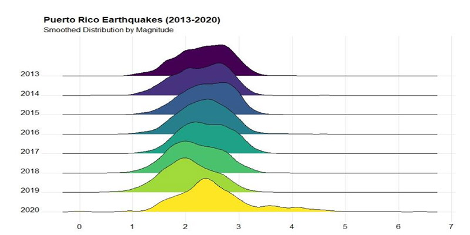

```{r setup, include=FALSE}
knitr::opts_chunk$set(echo = TRUE, eval = FALSE)
```

My mother's hometown, Ponce, has been hit badly by the recent earthquakes. A cousin asked me to "play with some data" and turns out that the USGS maintains great data on seismic activity in the Caribbean. I focused on coordinates close to PR to produce the attached visual. I'll revisit this visualization in a few months when more data becomes available!



Links:

* U.S. Geologival Survey: [https://www.usgs.gov/](https://www.usgs.gov/)