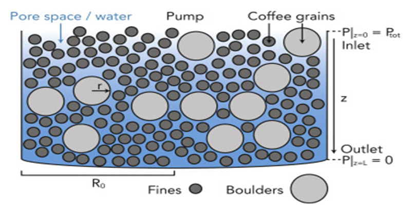

```{r setup, include=FALSE}
knitr::opts_chunk$set(echo = TRUE, eval = FALSE)
```

I upgraded my espresso machine over the holidays and have been pleasantly surprised by the need to recalibrate my machine's settings with every new batch of coffee (and of course, fresh roasted is best). Glad to see some math support my observations. :-)



Source:

* Systematically Improving Espresso: [Insights from Mathematical Modeling and Experiment](https://www.cell.com/matter/fulltext/S2590-2385(19)30410-2?_returnURL=https%3A%2F%2Flinkinghub.elsevier.com%2Fretrieve%2Fpii%2FS2590238519304102%3Fshowall%3Dtrue)