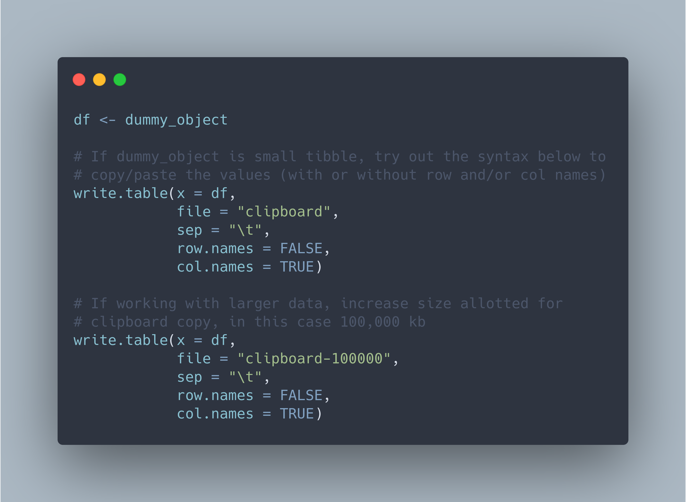

```{r setup, include=FALSE}
knitr::opts_chunk$set(echo = TRUE, eval = FALSE)
```

You learn something new every day, even basics! For R users on Windows (I'm assuming the same holds true for Mac and Linux users), do you ever find yourself needing to quickly export a dataframe or tibble to Excel or a text editor? I recently discovered base R's `write.table` function and have used it much more often than I anticipated.

See below syntax as an example:

