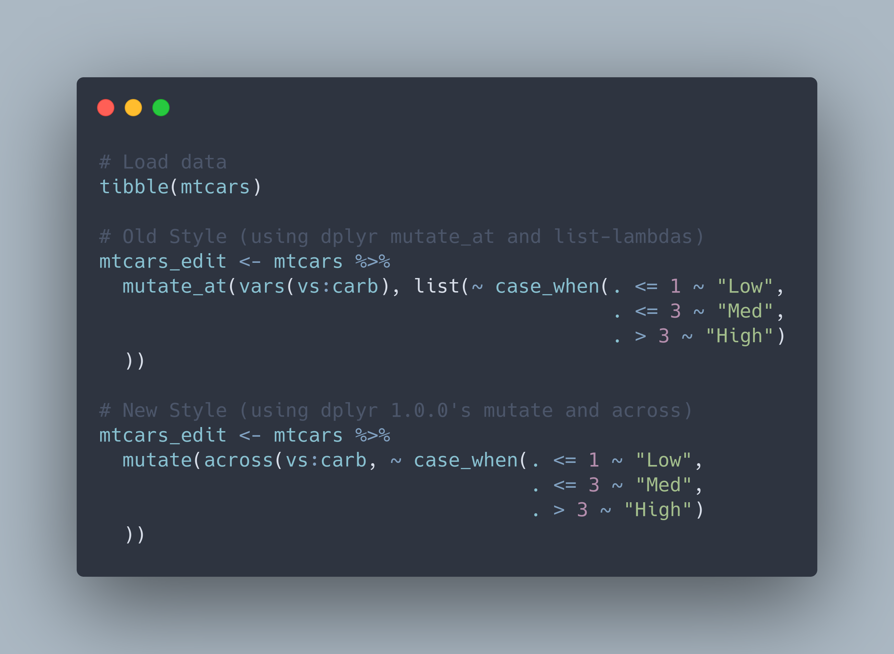

```{r setup, include=FALSE}
knitr::opts_chunk$set(echo = TRUE, eval = FALSE)
```

I had read about the new `across()` function hype and now I get it... No more `mutate_at()` or `summarise_at()` with the cryptic list-lambdas. As the dplyr documentation states, "`across()` supersedes the family of "scoped variants" like `summarise_at()`, `summarise_if()`, and `summarise_all()`."

Below is an example highlighting the new `across()` syntax meant to be used within a `mutate()` function. I tried this on a few columns of the mtcars data set with dplyr's `case_when()` a la SQL CASE_WHEN (as opposed to nesting multiple `if_else()` statements to the point of confusion!). The dplyr changes are subtle but will definitely streamline my data wrangling.



Source:<br>
* [dplyr, a core tidyverse package](https://dplyr.tidyverse.org/)