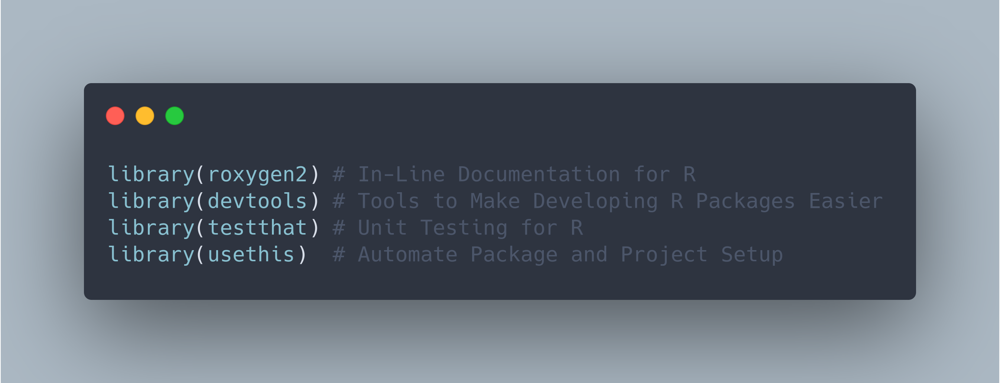

```{r setup, include=FALSE}
knitr::opts_chunk$set(echo = TRUE, eval = FALSE)
```

I'll keep this short since all credit should go towards the amazing Cosima Meyer and Dennis Hammerschmidton... They compressed some of the most valuable steps for creating and deploying a package. This duo's work was published for the MZES Social Science Data Lab. If you want a detailed and easy-to-follow how-to for R package development, bookmark this step-by-step guide!



Source:<br>
* Methods Bites: [How to write your own R package and publish it on CRAN](https://www.mzes.uni-mannheim.de/socialsciencedatalab/article/r-package/)