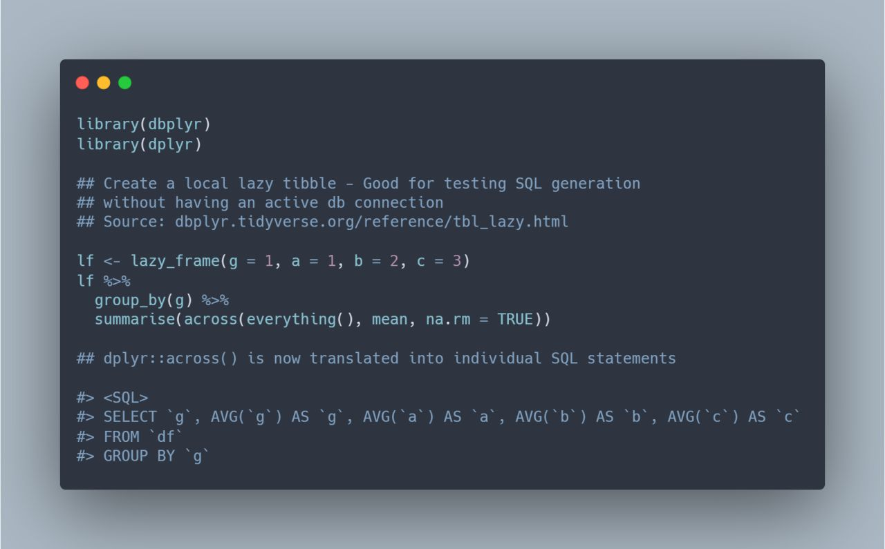

```{r setup, include=FALSE}
knitr::opts_chunk$set(echo = TRUE, eval = FALSE)
```

`dbplyr` 2.0.0 comes loaded with improvements including the translation of `dplyr`'s new `across()` function. If you aren't familiar with this library, `dbplyr` translates your `dplyr` syntax to SQL. I regularly connect to enterprise databases using R and have almost completely transitioned from SQL. Yes, SQL is awesome. Yes, using `dplyr` is a lot more fun!



Source:<br>
* tidyverse blog's [dbplyr 2.0.0 Official Announcement](https://www.tidyverse.org/blog/2020/11/dbplyr-2-0-0/)