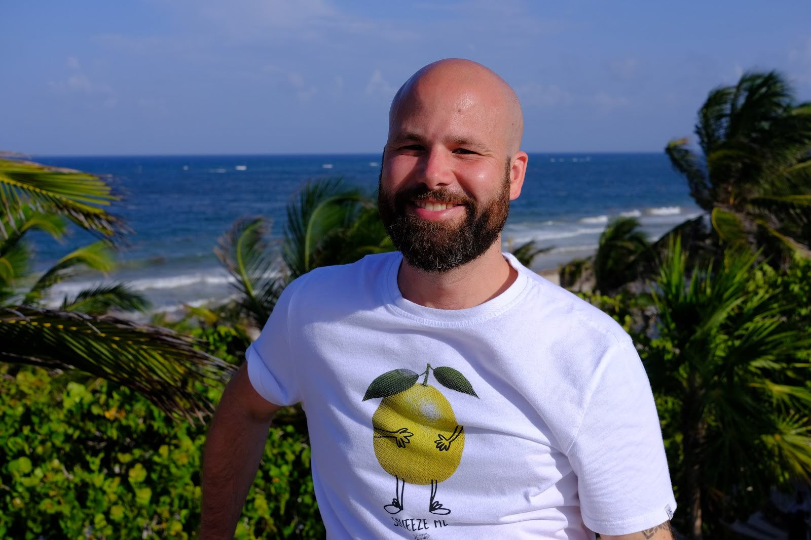

```{r setup, include=FALSE}
knitr::opts_chunk$set(echo = FALSE)
```



My name is Javier Orraca and I'm a data scientist. I enjoy building predictive models, developing web applications, cooking, reading, and playing board games. For a living, I get to solve puzzles with data - Life is good.

## Professional

My career includes over a decade of data science, financial strategy, and business analytics for EY, PG&E, KPMG, and Health Net (a Centene Corporation company). As a Data Scientist at Health Net, I work for a Strategic Insights team supporting our Product Performance organization. I help our business develop predictive algorithms and deploy web apps for our internal leaders and Sales teams. I also get to have some extra fun at work by co-hosting a monthly Centene R User Group for our company's analysts and data scientists. 

## Scatter Podcast

I launched [Scatter Podcast](https://soundcloud.com/scatterpodcast) to share career tips and insights from data science leaders that I interview from time to time. In 2020, I teamed up with a friend, [Joel Dayrit](http://jfdayrit.com/), to further explore data analytics, insights, and data science in business. We hope to be more productive with the podcast in 2021.

## Programming & Analytics Skills

* **R**: RStudio pro tools, R Markdown, Shiny, tidyverse, tidymodels, distill, plotly, leaflet, fable, feasts, Facebook's Prophet & NeuralProphet R implementations, and many more
* **Other Analytics & Programming Platforms**: JupyterHub, Jupyter Lab, GitLab, GitHub, RStudio Connect, Julia, NetBase, SQL, SAP Business Objects, Hugo, Netlify, Quest Analytics
* **Microsoft**: Expert-level MS Access and Excel user with experience creating pivot tables, nested IF statements, INDEX / MATCH functions, VLOOKUP / HLOOKUP functions, Solver (for optimization and simulations... yes... in Excel!), macros for data manipulation pipelines, ODBC integration, query design (joins, crosstab, make-table, etc.), reports, and forms

## Media Appearances

* Scatter Podcast mention on Forbes: [https://forbes.com/how-to-get-your-data-scientist-career-started](https://forbes.com/sites/louiscolumbus/2019/04/14/how-to-get-your-data-scientist-career-started)
* Scatter Podcast on UC Irvine News: [https://merage.uci.edu/news/2019/06/scatterpodcast](https://merage.uci.edu/news/2019/06/podcast-launched-by-merage-student-navigates-complex-field-of-data-analytics-and-science.html)
* Orange County Predictive Modeling Hackathon Winner: [https://twitter.com/oc_rug/status/oc-r-users-group-hackathon-best-model](https://twitter.com/oc_rug/status/1130553620456300544?s=20)
* UC Irvine Student Profile: [https://merage.uci.edu/programs/masters/master-science-business-analytics](https://merage.uci.edu/programs/masters/master-science-business-analytics/curriculum.html)

## Web Development

I am not a web developer but I created this website using the [R](https://www.r-project.org/) programming language, [RStudio](https://www.rstudio.com/), and the [Distill](https://rstudio.github.io/distill/) package, an R web publishing framework that feels intuitive and easy to use if you're already familiar with R Markdown and blogdown. This site is being hosted for free on GitHub and it costs me $15/year for the domain name. Open-source tools are fast, flexible, fun, and the future of data science.

## Contact Info and Social

* LinkedIn: [https://www.linkedin.com/in/orraca/](https://www.linkedin.com/in/orraca/)
* Scatter Podcast on SoundCloud: [https://soundcloud.com/scatterpodcast](https://soundcloud.com/scatterpodcast)
* GitHub: [https://github.com/JavOrraca](https://github.com/JavOrraca)